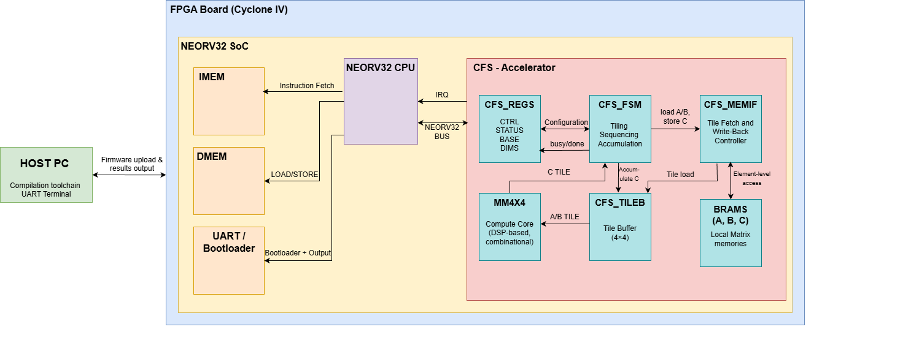

# Overview
This project is  my **Final Year Project (FYP)** for the **Bachelor of Electronics Engineering Majoring in Computer**.

It implements a fixed-point neural network inference engine as a custom hardware accelerator integrated within a NEORV32 RISC-V soft-core processor on an Intel Cyclone IV FPGA. The accelerator offloads compute-intensive matrix operations from the CPU using a tiled 4×4 combinational matrix multiplication architecture, coordinated by a finite state machine and accessed through a memory-mapped custom function subsystem (CFS) interface. Neural network inference is performed entirely in fixed-point arithmetic, with int16 weights, Q-format inputs and int32 accumulation,. The system demonstrates a complete hardware-software co-design flow, including RTL design, firmware control, BRAM-based data movement, simulation-based verification, and on-FPGA evaluation of AI workload acceleration.

The developed inference engine is **generic and reusable** for many embedded AI use cases.
For demonstration and validation, it is applied to a **weather comfort classification system**, where **temperature and humidity inputs** are processed to produce a comfort classification (comfortable/uncomfortable).


---
# System Overview
Platform:
* FPGA: Intel Cyclone IV
* Processor: Sotcore RISC-V (NEORV32)
* Languages: VHDL, C, Python
* Tools: Quartus, ModelSim, WSL, GCC, TeraTerm,

 

# Neural Network Details

The neural network was designed and trained in **Python using TensorFlow**.
Its architecture is:

**2 → 16 → 16 → 8 → 1**

Training produces floating-point weights and biases, which are then **quantized** for embedded deployment.

Key points:

* Training and export are performed using the Python scripts included in this repository
* Weights are **quantized from float to int16**
* All parameters are exported to **C header files** for use by the firmware

Floating-point arithmetic is intentionally avoided in hardware due to its **high cost on embedded systems**.

---

# Inference Engine (AI Accelerator)

The inference engine is implemented as a **custom hardware accelerator** integrated inside a **NEORV32 RISC-V soft-core CPU**.

## Core Modules (High Level)

* **Matrix Multiplier (mm4x4):** Fully combinational 4×4 matrix multiplier optimized for DSP efficiency and FPGA timing constraints.
* **Tiling & Buffering:** Scales matrix operations up to 16×16 using 4×4 tiles with buffered accumulation.
* **FSM Controller:** Central control logic orchestrating tiling, memory access, accumulation, and execution flow.
* **Memory Interface:** Manages BRAM data movement between memory and tile buffers for compute operations.
* **NEORV32 CFS Interface:** Memory-mapped hardware–software interface enabling full accelerator control from RISC-V firmware.

---


# Quantization Strategy

This project employs a fixed-point quantization strategy to enable efficient neural network inference on FPGA hardware, replacing floating-point operations with resource efficient integer arithmetic. Different Q-formats are used across network layers such as higher precision in early layers and wider dynamic range in later layers, achieving a practical balance between accuracy, overflow prevention, and FPGA resource utilization, making the design suitable for real-time embedded AI acceleration.

---

# Firmware

The **bare-metal C firmware** running on the NEORV32 CPU is responsible for:

* Quantizing inputs and intermediate results
* Applying padding
* Loading matrices into accelerator memory
* Triggering accelerator execution
* Reading back results
* Applying bias addition and activation functions (ReLU, Sigmoid)
* Printing results via UART

---


# Compile-Time Logging Modes

The firmware implements a **compile-time configurable UART-based framework** for debugging, validation, and performance evaluation. Logging modes are selected at compile time to keep runtime behavior deterministic and prevent UART flooding.

* **INFO** – Minimal, high-level output intended for demos and reporting (accuracy and performance results)
* **DEBUG** – Detailed diagnostic output for verification (intermediate activations, CPU vs accelerator comparisons)

---

# Results

The primary reported metrics are **classification accuracy** and **accelerator speedup**, printed via UART when running in **INFO mode**.

```
[INF] NN ENGINE REPORT
[INF] Saturation counts: a1=0 a2=0 a3=0
[INF] ACCURACY RESULT: 480 / 500 correct
[INF] ACCURACY: 96.0
[INF] CONFUSION: TP=82 TN=398 FP=4 FN=16
[INF] CPU and NN Engine match: maxdiff(L2/L3/L4)=0/0/0 (cpu vs accel)
[INF] Total cycles (NN ENGINE): 308288726
[INF] Cycles / inference (NN ENGINE): 616577
[INF] Cycles / MAC (NN ENGINE): 32113 (×1e-2)
[INF] Total cycles (CPU): 764067726
[INF] Cycles / inference (CPU): 1528135
[INF] Cycles / MAC (CPU): 79590 (×1e-2)
[INF] Achieved Speedup: 2.47×
```

---

# Functional Validation & Accuracy

The script `scripts/test_dataset.py` generates **500 unique temperature–humidity samples**, with ground-truth labels computed from the analytical decision equation.
These same samples are processed by the hardware inference engine, and predicted labels are compared against the Python reference.

Accuracy is computed as:

```
Accuracy = (correct_predictions / total_samples) × 100
```

---

# Performance Measurement

Performance is evaluated by measuring execution cycles for both **CPU-only** and **hardware-accelerated** inference using hardware cycle counters. Identical workloads are used to ensure a fair comparison.

Speedup is computed as:

```
Speedup = (CPU cycles per inference) / (Accelerator cycles per inference)
```


---


